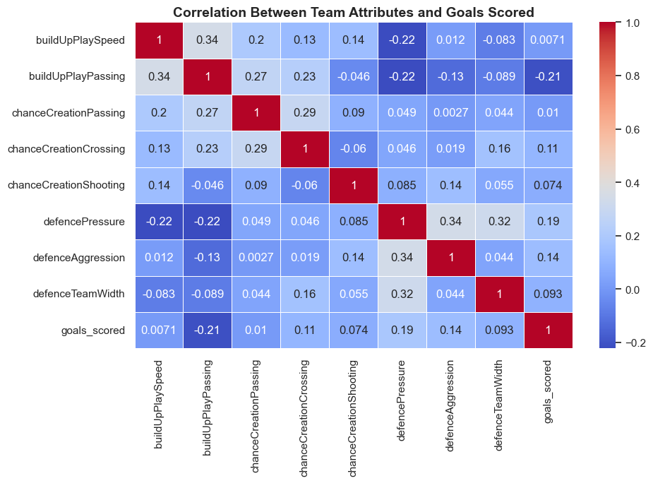
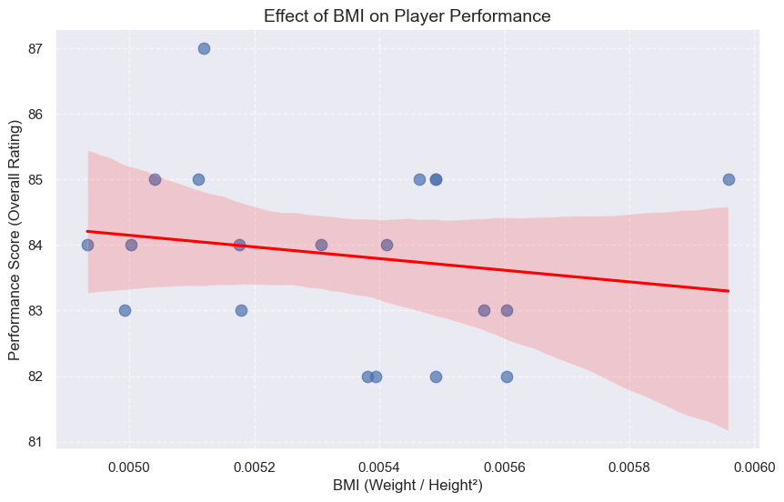

# The-European-Soccer
The European Soccer
115
116
117
118
119
120
121
122
123
124
125
126
127
128
129
130
131
132
133
134
135
136
137
138
139
140
141
142
143
144
145
146
147
148
149
150
151
152
153
154
155
156
157
158
159
160
161
162
163
164
165
166
167
168
169
170
171
172
173
174
175
176
177
178
179
180
181
182
183
184
185
186
# The European Soccer
15.Monthly Goal Trends
Goal-scoring totals fluctuate significantly by month.

16.Country-Wise Average Goals
Country-specific goal averages deviate from the overall mean.

17.Top Ten Teams by Wins
Real Madrid, Barcelona, and Bayern Munich lead in total wins across seasons.

18.Key Team Attributes Affecting Performance
Offensive strategies, player quality, and defensive tactics are highly correlated with goal-scoring success.

19.Goal Trends for Top La Liga Teams
Top clubs like Real Madrid and Barcelona show consistent goal-scoring with minor seasonal fluctuations.

20.Player BMI and Performance
A slight positive correlation suggests that players with an optimal BMI often achieve higher overall ratings.

    
# Conclusion 

In conclusion, this data analysis project using the European Soccer Database provided useful insights to help improve a sports channel’s soccer coverage. The analysis explored team performance, match activity, player achievements, and trends, helping to create interesting stories and better fan engagement.

The results showed that teams like Real Madrid, Barcelona, and Bayern Munich were consistently strong, while players like Cristiano Ronaldo, Lionel Messi, and Franck Ribéry stood out for their performances. The 2015–2016 season was especially important because of the high number of goals scored.

The project also uncovered patterns in tactics, team strategies, and the link between player fitness (BMI) and performance. These insights can help the sports channel create more interesting and informative content for its audience.

# Recommendations

1.Tell Stories with Data

Use the insights to create interesting stories about top-performing players, famous team rivalries, and goal trends for match previews and reviews.

2.Predict Match Results

Use historical data to predict future games, spot rising star players, and build excitement before matches.

3.Engage Fans

Turn the insights into fun polls, quizzes, and graphics for social media and live shows to get fans more involved.

4.Player Fitness Content

Develop content that connects player fitness and BMI data with performance, offering unique insights for health-conscious fans and sports analysts alike.

5.Season Highlights
Make special episodes to review standout seasons like 2015–2016, focusing on goal records and team achievements.

6.Support for Analysts and Commentators

Give data and visuals to presenters and analysts to help them share deeper insights during matches.

7.Tactical Breakdowns
Use the analysis on team tactics and goal patterns to create simple videos or articles that explain how teams win matches.

###  Thank you!

Email: mays802004@gmail.com

GitHub: @maysasaad   

### Repository Structure

├── data ├── images ├── README.md ├── Presentation.pdf └── Jupyter notebook.ipynb
Use Control + Shift + m to toggle the tab key moving focus. Alternatively, use esc then tab to move to the next interactive element on the page.
No file chosen
Attach files by dragging & dropping, selecting or pasting them.
