# The European Soccer

## Project Overview
This project uses SQL queries to extract, clean, and analyze data from the European Soccer Database, aiming to deliver actionable insights for a sports channel's content strategy.

### Business Problem
A leading sports channel seeks to enhance its soccer coverage by offering engaging, data-driven content and in-depth analysis. Leveraging historical data from the European Soccer Database will help uncover patterns, performance metrics, and insights that inform both editorial decisions and audience engagement strategies.

### The Data Source and Data Exploration
The dataset used in this project is sourced from Kaggle's European Soccer Database, consisting of six key tables: :

Country - Country names.

Matches – Results, team stats

Teams – Information on clubs

Players – Player statistics, attributes, and career history

Leagues –  league's names

Team_Attributes – Performance metrics of teams

Player_Attributes – Player skills and ratings

### Data Analysis
Data only speaks when asked the right questions. To turn raw data into actionable insights, I focused on addressing the following business-driven questions:

How many teams are there in each country?

How many matches were played in each league?

Which teams belong to each league?

Who are the top ten teams by performance over multiple seasons?

Who are the top ten players in Europe over the period?

Which season can be considered a "trend season"?

What are the total home goals scored, grouped by country and team?

How many goals did each team score, grouped by season?

How do leagues differ in terms of average goals per match?

How many total goals were scored by home and away teams, grouped by country and season?

What were the win percentages and aggregated win/loss records, along with goals scored and conceded per team, per season?

Which teams had the most wins across all seasons and leagues?

Which team attributes have the biggest impact on total goals scored?

How did the aggregated goals for the top five scoring teams in Spain's La Liga evolve over time?

The total and average number of goals per league in 2011/2012 Season?how many goals were scored in each match in 2011/2012, and how did that compare to the average

Average number of goals scored in match across all seasons?

Average Goals per Match by Country (2008/2009 Season) ?

What is the average number of goals scored in each country across all match seasons ?

Country's average goals differ from the over all avarage?

How does each month's total goals differ from the monthly average of goals scored?

Matches with10 goals ?

Which match stages, where the stakes get higher in each stage, tend to have a higher than average number of goals scored on season 2013/2014 ?

Did a player's BMI influence their performance score (overall rating)?

Analyzing Real Madid Resuls 

### Results

1.League Popularity

The analysis revealed the distribution of teams across different national leagues. Notably, France's Ligue 1 hosts the highest number of teams, followed by England’s Premier League.
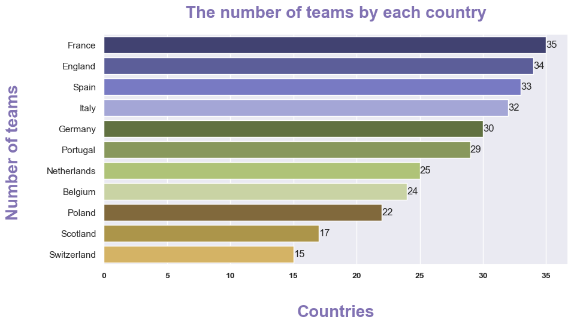

2.League Activity

Leagues with a higher number of matches are typically those with more teams and extended seasons. For example, Spain's La Liga (LIGA BBVA) recorded the highest number of matches.
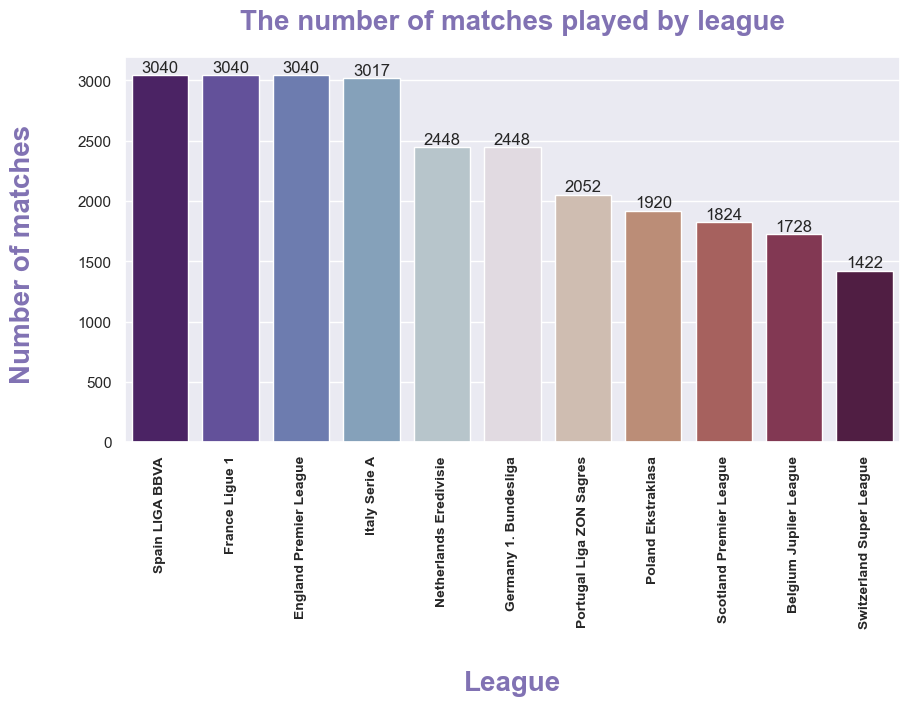

3.Top Ten Teams by Performance Over Seasons

Teams such as Real Madrid, Barcelona, and Bayern Munich consistently ranked among the top across multiple seasons, both in total points and win percentage.
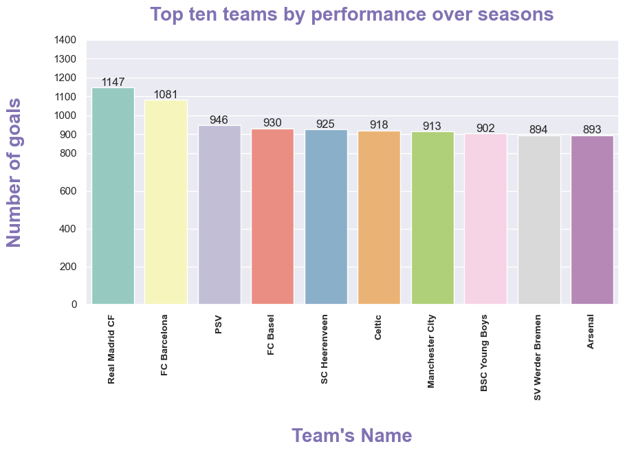

4.Top 10 Players in Europe Over the Period

The top-performing players included Cristiano Ronaldo, Franck Ribéry, Lionel Messi, Philipp Lahm, Wayne Rooney, Xavi Hernández, Zlatan Ibrahimović, Arjen Robben, Cesc Fàbregas, and Petr Čech.
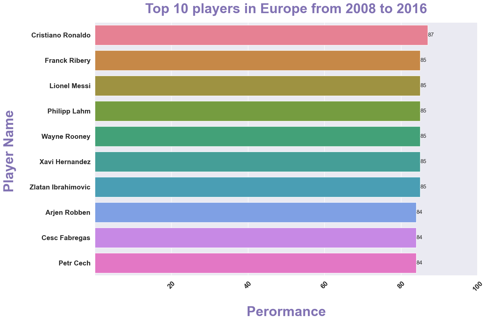

5.Trend Season Identification

The 2015–2016 season stood out as the trend-setting period due to a notable surge in goals scored, reaching a total of 9,162 goals.
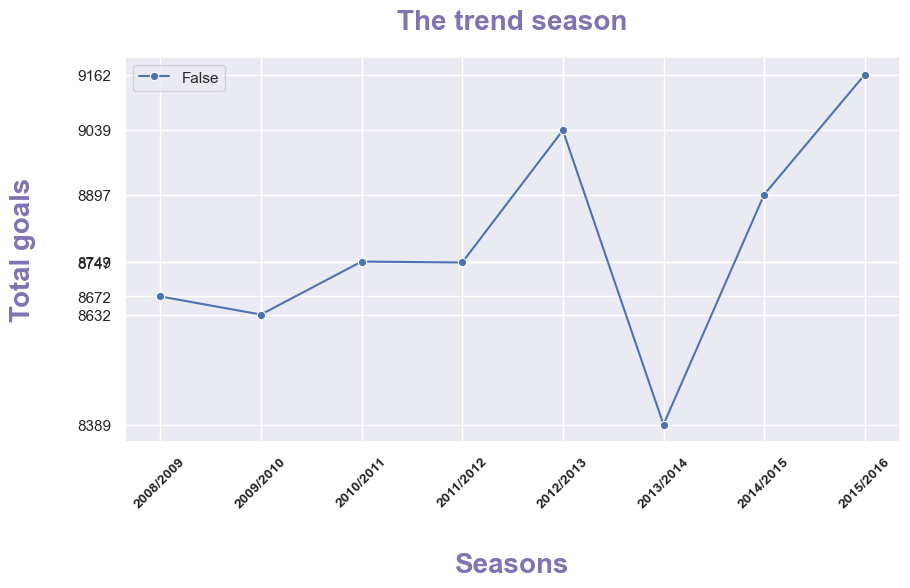

6.Goals Scored by Each Team Grouped by Season

Real Madrid CF achieved the highest number of home goals during the 2015–2016 season.
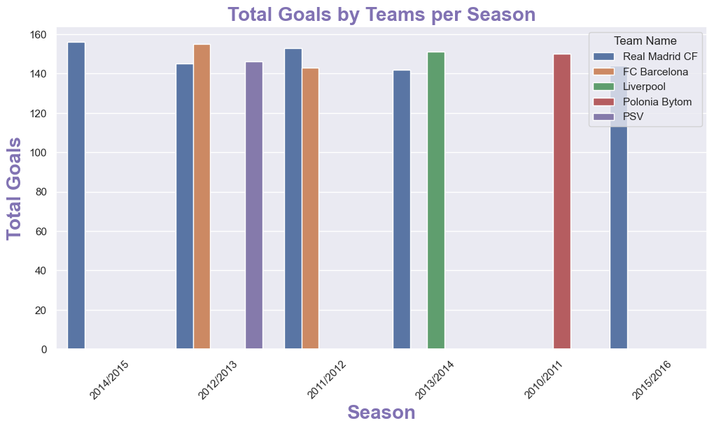

7.Win Percentage and Match RecordsAverage number of goals scored in match across all seasons

Teams like Juventus and Real Madrid consistently posted the highest win percentages over the analyzed seasons.

8.Top Ten Teams with the Most Wins Across All Seasons and Leagues

Real Madrid, Barcelona, and Bayern Munich emerged as the top three clubs with the most victories throughout the dataset.

9.Team Attributes Impacting Performance (Goals Scored)

Offensive strategies, the presence of star players, and solid defensive tactics were identified as key factors influencing a team's total goals scored.
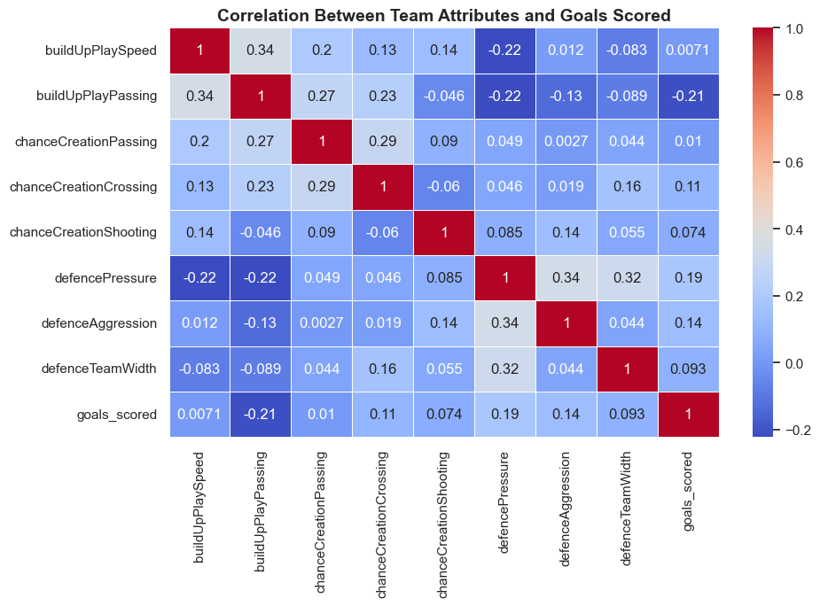

10.Aggregated Goals for the Top Five Highest-Scoring Teams in Spain (La Liga)

The top five teams, including Real Madrid and Barcelona, demonstrated consistent goal-scoring performance with only minor seasonal variations.
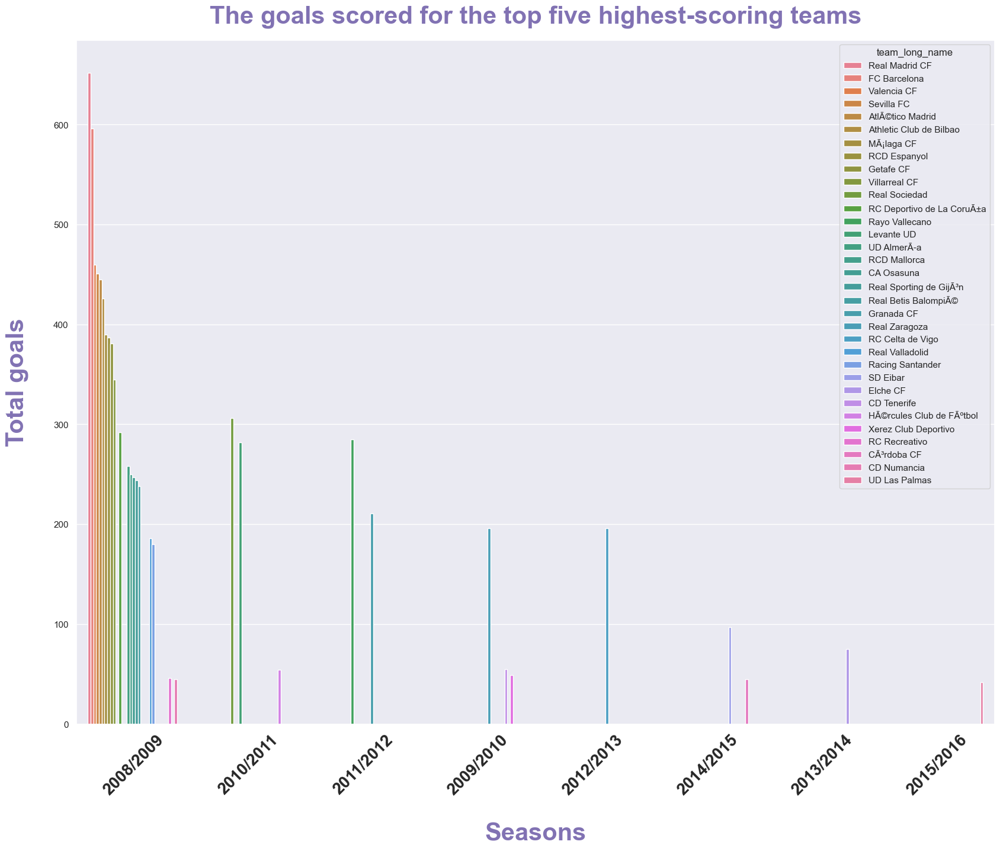 

11.The total and average number of goals per league in 2011/2012 Season

The analysis highlighted clear differences in total and average goals scored across leagues during the 2011–2012 season.
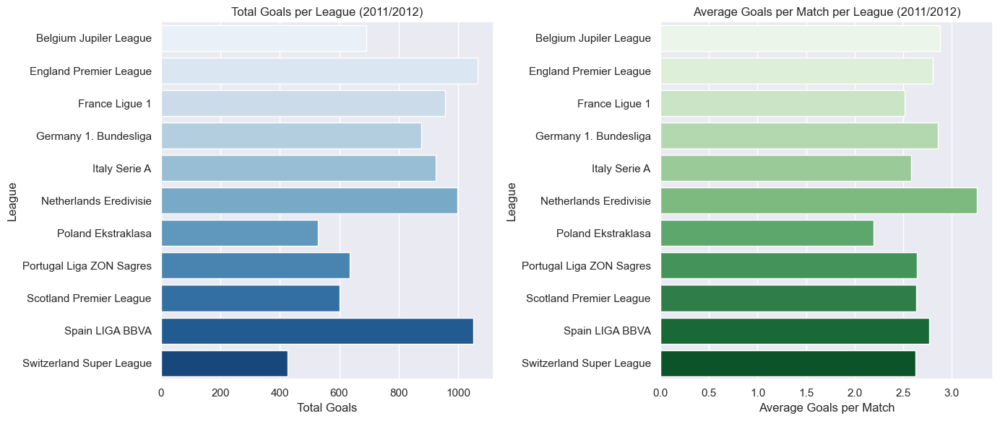

12.Average number of goals scored in match across all seasons

13.Average Goals per Match by Country (2008/2009 Season)

14.Country's average goals differ from the over all avarage

15.Monthly Goal Trends

Goal-scoring totals fluctuate significantly by month.
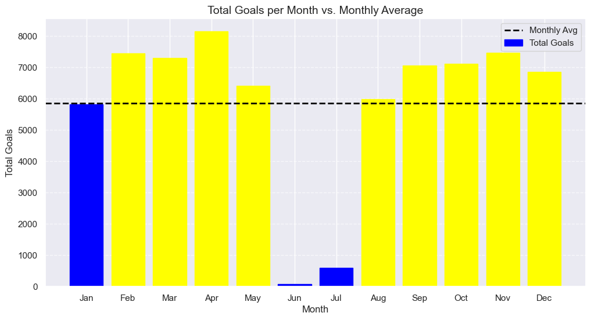

16.Fitness Insight: The Impact of BMI on Player Performance

The analysis showed a slight correlation between players’ Body Mass Index (BMI) and their overall performance ratings. Players with an optimal BMI tended to achieve higher scores.
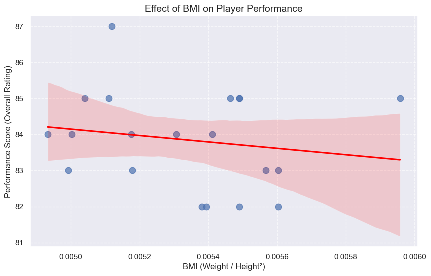

17.Top 3 Teams with Highest Average Home Goals (Spain 2011/2012)

18.Analyze Real Madrid's Results

Real Madrid's Home vs. Away Wins

Real Madrid Home & Away Goals per Season

Average Goals per Season for Real Madrid

Real Madrid CF Performance Over Seasons

    
# Conclusion 

In conclusion, this data analysis project using the European Soccer Database provided useful insights to help improve a sports channel’s soccer coverage. The analysis explored team performance, match activity, player achievements, and trends, helping to create interesting stories and better fan engagement.

The results showed that teams like Real Madrid, Barcelona, and Bayern Munich were consistently strong, while players like Cristiano Ronaldo, Lionel Messi, and Franck Ribéry stood out for their performances. The 2015–2016 season was especially important because of the high number of goals scored.

The project also uncovered patterns in tactics, team strategies, and the link between player fitness (BMI) and performance. These insights can help the sports channel create more interesting and informative content for its audience.

# Recommendations

1.Tell Stories with Data

Use the insights to create interesting stories about top-performing players, famous team rivalries, and goal trends for match previews and reviews.

2.Predict Match Results

Use historical data to predict future games, spot rising star players, and build excitement before matches.

3.Engage Fans

Turn the insights into fun polls, quizzes, and graphics for social media and live shows to get fans more involved.

4.Player Fitness Content

Develop content that connects player fitness and BMI data with performance, offering unique insights for health-conscious fans and sports analysts alike.

5.Season Highlights
Make special episodes to review standout seasons like 2015–2016, focusing on goal records and team achievements.

6.Support for Analysts and Commentators

Give data and visuals to presenters and analysts to help them share deeper insights during matches.

7.Tactical Breakdowns
Use the analysis on team tactics and goal patterns to create simple videos or articles that explain how teams win matches.

###  Thank you!

Email: mays802004@gmail.com

GitHub: @maysasaad   

### Repository Structure

├── data ├── images ├── README.md ├── Presentation.pdf └── Jupyter notebook.ipynb

